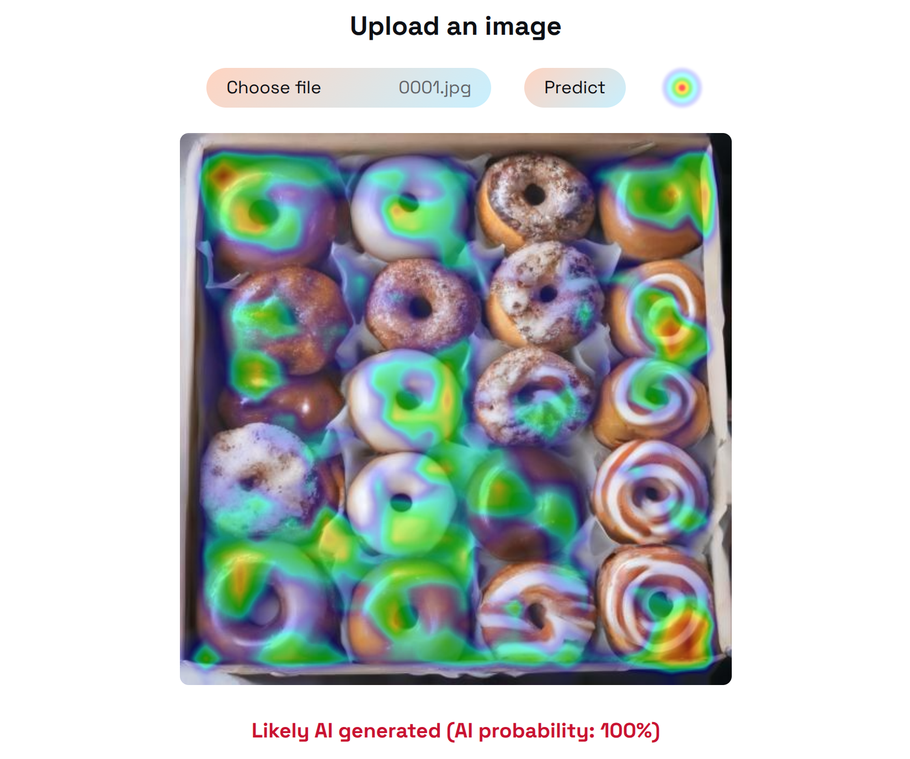

# Interpretable AI image detector

A lightweight web application that detects AI-generated images using a custom convolutional neural network (CNN) and provides visual explanations via Grad-CAM heatmaps.

**[Try the live demo](https://dovydaszem-ai-image-detector.hf.space)**

## Overview

The model is a binary CNN classifier trained from scratch to output a single logit representing the probability that an input image is AI generated. When the prediction exceeds a chosen threshold, a Grad-CAM heatmap is computed from the final convolutional layer and overlaid on the image to highlight regions that most influence the decision.

The CNN was trained on 5k images generated with SDXL Turbo and 5k real images from MS COCO dataset.

## Deployment

The project is deployed to Hugging Face Spaces using Docker. A GitHub Actions workflow automatically syncs the repository and rebuilds the Space on every push to `main`.

## Local setup

### Option 1: Conda (development)

conda env create -f environment.yml  
conda activate ai-image-detector  
cd ai-image-detector/app  
./launch.sh  
Open http://localhost:8000 in your browser.

### Option 2: Docker

cd ai-image-detector/  
docker build -t ai-image-detector .  
docker run -p 8000:7860 ai-image-detector  
Open http://localhost:8000 in your browser.